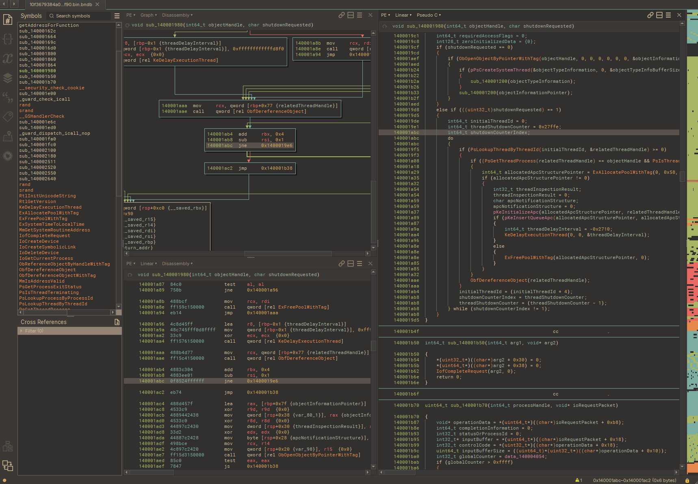
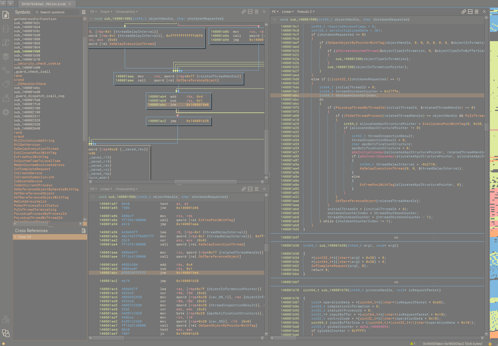
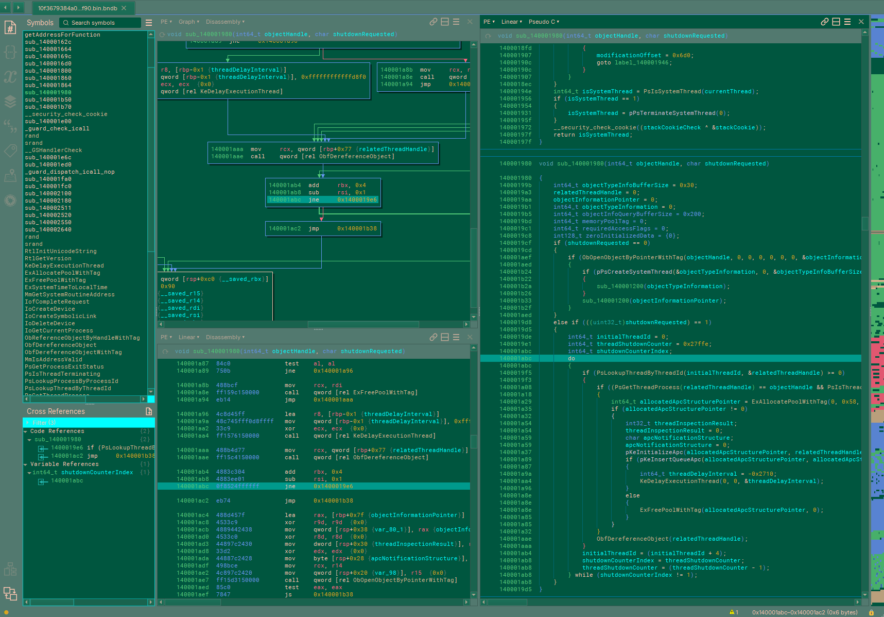

# Binary Ninja Themes

I wanted to briefly share some themes I put together for `Binary Ninja`. This started because I like the `Gruvbox Material` community theme but I had some minor issues with it and I ended up making three themes:

- **gruvbox-b33f**: This one is mostly identical to `Gruvbox Material` but with some small tweaks.
- **gruvbox-b33f-light**: Fully custom light theme.
- **gruvbox-b33f-castleton**: Fully custom green theme.

To install these themes, simply download the bntheme files into the `themes/` subfolder of your [user folder](https://docs.binary.ninja/guide/index.html#user-folder) (you might need to make the folder).

## Demo

### gruvbox b33f

### gruvbox b33f light

### gruvbox b33f castleton

